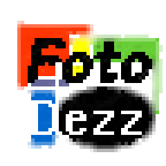
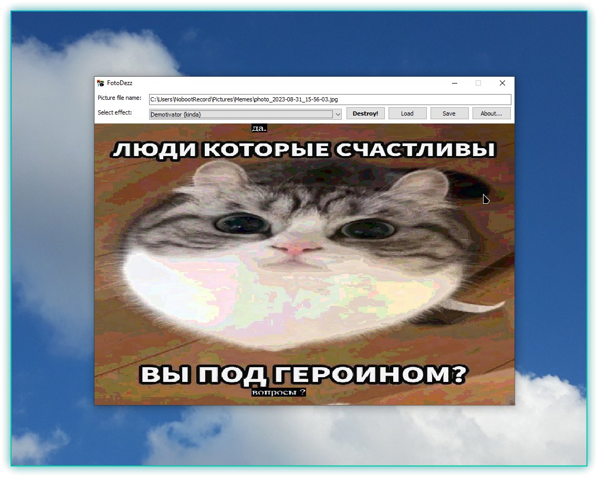

# FotoDezz

### Уничтожитель изображений, упоротый генератор мемов

**\[[English](README.md) / [Русский](README-RU.md)\]**

---

**FotoDezz** - очередная непонятная, никому не ведомая и не нужная хрень, написанная мной буквально на коленке. Это попытка создать свой маленький инструмент для создания простеньких мемов (типа демотиватора, "needs more jpeg" aka "шакал \*\*\*\*ий" и тому подобных), а также уничтожения изображений с использованием самописных спецэффектов типа инверсии, диффузии и прочей ерунды (на базе функций Win32 GDI).

Я занимался разработкой проекта весной 2021 года, релизы программы выкидывал в свою группу в ВК (которая через год была закрыта). Последняя версия (кажется, `1.3`) была выпущена в апреле, а спустя месяц я объявил о прекращении разработки программы.

Исходные коды этого шедевра чудом сохранились у моего знакомого [Alloyd](https://github.com/Alloyd031), который в это время также занимался разработкой FotoDezz - а если быть точнее, делал его своеобразный "мод". Сам FotoDezz - внезапно - был Freeware-программой, исходные коды открыты не были (до наших дней).

Исходные коды опубликованы на условиях [Нелицензии](UNLICENSE.txt). На авторские права положен болт.

