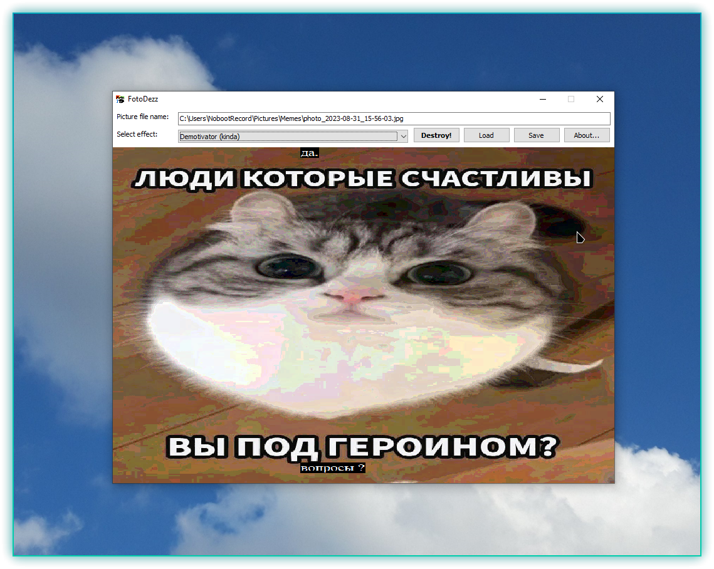

# FotoDezz

### Image destroyer, meme generator (kinda)

**\[[English](README.md) / [Русский](README-RU.md)\]**

---

**FotoDezz** is another shit program written by me just for fun, similar to other my projects.

FotoDezz has been developed using Delphi 7 originally (Win32 only), recompiled using Free Pascal + Lazarus IDE (Win32 + Win64) and inspired by one Telegram bot which created nice memes like demotivators or "needs more jpeg \[compression\]". I decided to create my own small program that could create memes like that. I also decided to add some simple yet nice effects like inverse which used Win32 GDI functions (inspired by some "GDI malware").

I had been developing this program in 2021. Program distributions had been published in my VKontakte public (closed in 2022). The last version, `1.3`, was released in April 2021 - in May 2021 the development completely stopped.

FotoDezz source codes were saved by [Alloyd](https://github.com/Alloyd031) who had been developing his own FotoDezz mod (FotoDezz was Freeware, not Open Source, lol).

FotoDezz is released under the terms of [The Unlicense](UNLICENSE.txt).

